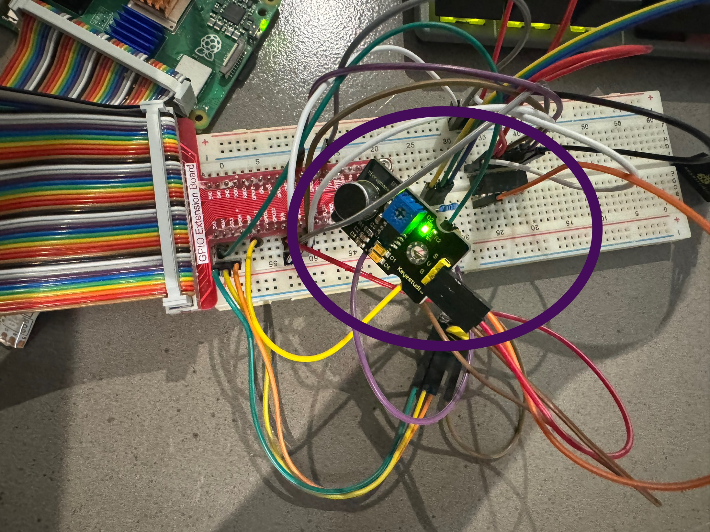
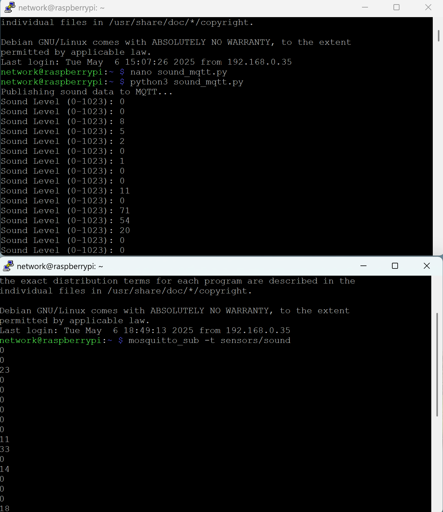

# Sound Sensor with Raspberry Pi and MQTT

This module demonstrates how to read sound level data from a Keyestudio Sound Sensor connected to a Raspberry Pi and publish the values to an MQTT broker.

---

## Hardware Setup

### Required Components
- Raspberry Pi with Raspberry Pi OS
- Keyestudio Sound Sensor
- Breadboard + Jumper wires
- GPIO Extension Board

### Wiring Overview

| Sensor Pin | Wire Color | GPIO Label | Pi Pin Function   |
|------------|------------|------------|--------------------|
| GND        | Black      | GND        | Pin 6              |
| VCC        | Red        | 3.3V/5V    | Pin 1 or 2         |
| OUT        | Yellow     | GPIO pin   | Example: GPIO17    |


### Hardware Photo



---

## Step 1: Read Sound Data

### Script: `read_sound.py`

This script reads analog sound values using the MCP3008 ADC and prints levels between 0 and 1023.

```bash
python3 read_sound.py
```

### Output Example

```
Sound Level (0–1023): 0
Sound Level (0–1023): 143
Sound Level (0–1023): 319
...
```


---

## Step 2: Publish to MQTT

### Script: `sound_mqtt.py`

This script reads the sound sensor data and publishes it to the topic `sensors/sound`.

```bash
python3 sound_mqtt.py
```

You should see:

```
Publishing sound data to MQTT...
Sound Level (0–1023): 32
Sound Level (0–1023): 240
...
```



---

## Step 3: Subscribe from MQTT Client

From another Raspberry Pi or MQTT client:

```bash
mosquitto_sub -t sensors/sound
```

You’ll receive real-time values like:

```
0
83
120
265
0
```

---

## Notes

- Data was tested and published **locally using MQTT**.
- This module is part of an ongoing development effort.

---

## Status

Work in Progress — basic functionality confirmed locally with MQTT.
