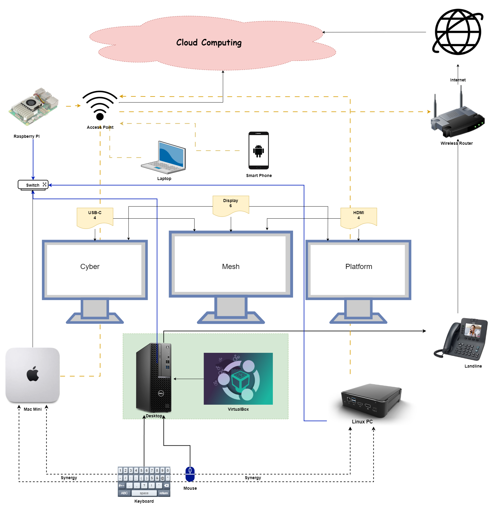

# CyberMesh Platform

“CyberMesh Platform: Building Secure, Scalable Internetworks”

The CyberMesh Platform is an integrated solution designed to unify and secure today’s complex network environments. Built on a robust mesh architecture, CyberMesh provides a scalable foundation for internetworking, ensuring stable connectivity across multiple subnetworks. By ensuring security at every level, CyberMesh safeguards critical data while fostering a flexible space for network development and experimentation. With CyberMesh Platform to experience the future of networking—where secure, distributed connections meet innovative design, you gain the agility to scale, the tools to build, and the confidence to innovate on your own terms.

